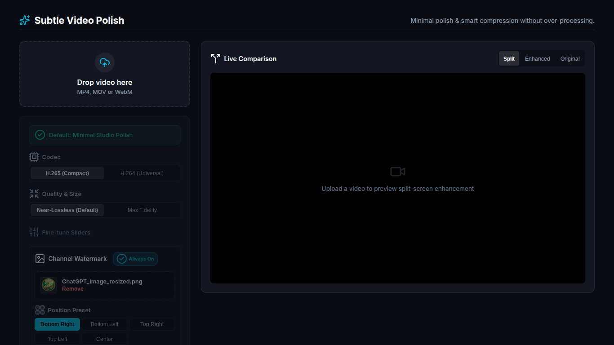
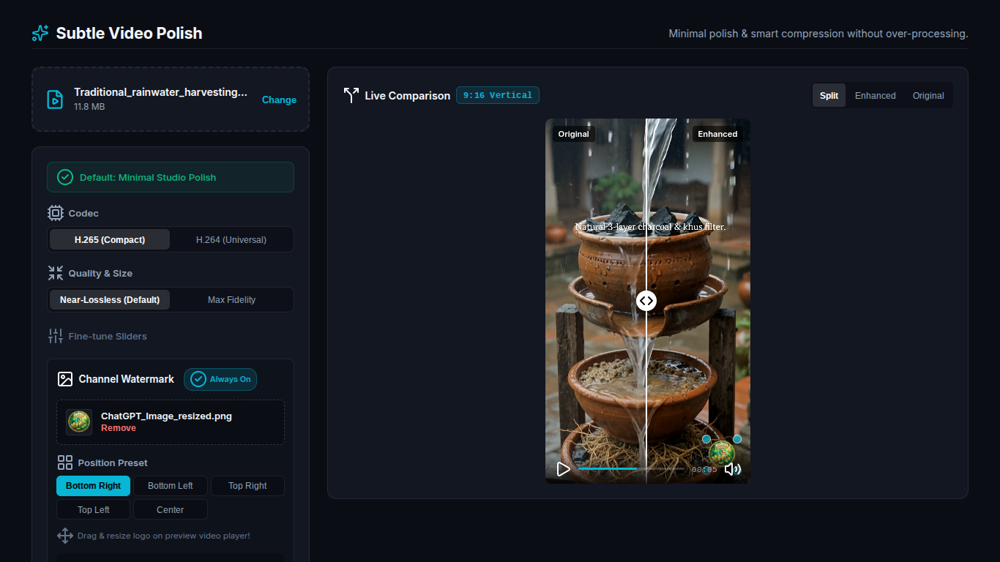
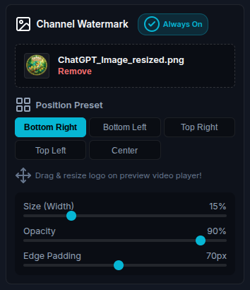

# Video Enhancement & AI Watermark / SynthID Scrubber Engine (v3.0)

A high-performance video enhancement, multi-codec compression, and AI watermark / SynthID scrubbing platform built with Node.js, Express, and FFmpeg.

## Features

- **Subtle Visual Enhancement**: Exposure adjustment, contrast boost, vibrance/saturation boost, unsharp masking, highlight rolloff, and smooth speed adjustment.
- **Smart Compression**: Multi-codec support (H.265 / HEVC for maximum compression, H.264 / AVC for universal playback) with tuned CRF presets.
- **Invisible SynthID Watermark Scrubbing**: Scrubs invisible spectral watermarks embedded by Google Gemini / Veo using spatial-frequency lossy perturbation (controlled noise injection, 3D spatio-temporal dequantization, micro-unsharp filtering, and metadata stripping `-map_metadata -1 -fflags +bitexact`).
- **Visible AI Watermark Removal**: Target corner logo removal for Google Gemini Sparkle, Veo video, and NotebookLM using auto-resolution detection and spatial delogo interpolation.
- **Interactive Watermark Overlay**: Drag-and-drop, corner-resize, opacity control, and position presets for custom channel logos.
- **Web UI & Live Split-Screen Viewport**: Interactive comparison slider with instant CSS preview filter synchronization.

## Screenshots

### Web UI Dashboard


### Real-Time Split-Screen Comparison


### Channel Watermark Controls & Settings


## Quick Start

### 1. Installation

```bash
npm install
```

### 2. Run Web Server

```bash
npm start
```
Open [http://localhost:3000](http://localhost:3000) in your browser.

### 3. Command Line Interface (CLI)

```bash
# Basic video polish and H.265 compression
node enhance_video.js -i input.mp4 -o clean.mp4

# Remove SynthID invisible watermark and Gemini visible logo
node enhance_video.js -i input.mp4 -o clean.mp4 --remove-synthid --synthid-strength 0.10 --remove-watermark --watermark-type gemini

# Full CLI Options
node enhance_video.js --help
```

## CLI Options

| Flag | Description |
|---|---|
| `-i, --input <file>` | Path to input video file (Required) |
| `-o, --output <file>` | Path to output video file |
| `--codec <h264\|h265>` | Video codec (Default: `h265`) |
| `--crf <value>` | Quality factor (Default: `24` for H.265, `20` for H.264) |
| `--remove-synthid` | Enable invisible SynthID frequency scrubbing |
| `--synthid-strength <val>` | SynthID scrubbing strength (`0.05`, `0.10`, `0.15`) |
| `--remove-watermark` | Remove visible AI watermark |
| `--watermark-type <type>` | Target profile (`gemini`, `veo`, `notebooklm`) |
| `--watermark <path>` | Path to channel overlay logo image |
| `--watermark-position <pos>`| Position (`bottom-right`, `bottom-left`, `top-right`, `top-left`, `center`, `custom`) |

## License

MIT
